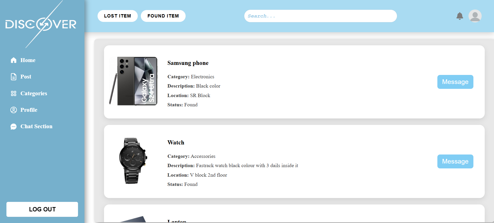
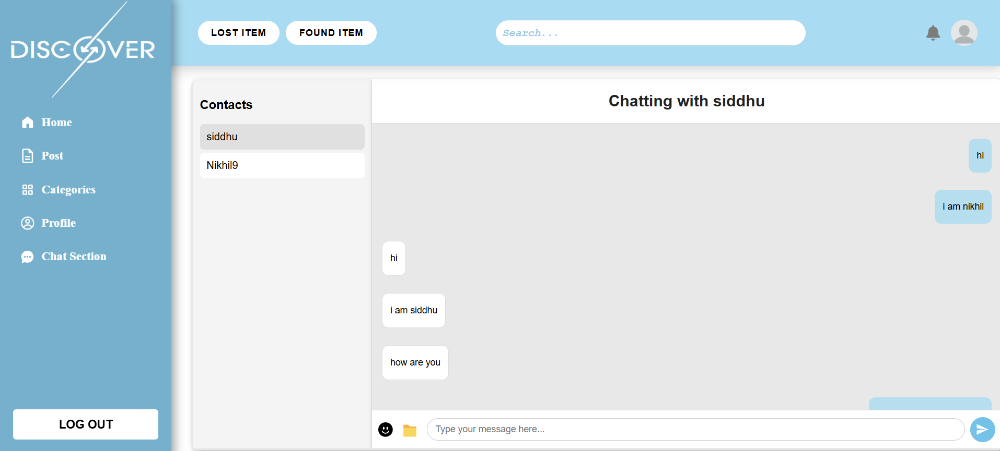

# 🧭 Lost and Found System

A full-stack web application designed to help users report and recover lost or found items. Users can post listings, search for items, and chat in real-time with item owners — making the process of reuniting people with their belongings faster and easier.

---

## 📁 Project Structure


---

## ✨ Features

- 👤 **User Authentication** (Signup, Login)
- 📌 **Create Posts** for lost or found items (with images)
- 🔍 **Search & Filter** for matching items
- 💬 **Real-time Chat** between item poster and finder
- 👤 **User Profile Page** with post history
- 🔐 **Password Reset** via email
- 🗃️ **Persistent Storage** using MongoDB
- 🖼️ Image upload using Multer

---

## ⚙️ Tech Stack

### 🌐 Frontend:
- or React
- Java AWT (for desktop variant if applicable)
- Axios for API calls

### 🖥 Backend:
- Node.js
- Express.js
- MongoDB + Mongoose
- Multer (file/image uploads)
- Socket.IO (real-time messaging)
- bcrypt (password hashing)
- JSON Web Tokens (JWT) for auth

## 🖼 Screenshots

### 🏠 Home Page


### 🔐 Login Page


### 💬 Chat Interface


### 🗄 Database:
- MongoDB Atlas

---

## 🛠️ Setup Instructions
### backend
cd backend
npm start
### frontend
cd frontend
npm rundev
### create an env file and add them
PORT=5000
MONGODB_URI=your_mongo_connection_string
JWT_SECRET=your_jwt_secret

### 🔃 Clone the Repo
```bash
git clone https://github.com/nikhil9345/Lost-and-Found-System.git
cd Lost-and-Found-System
